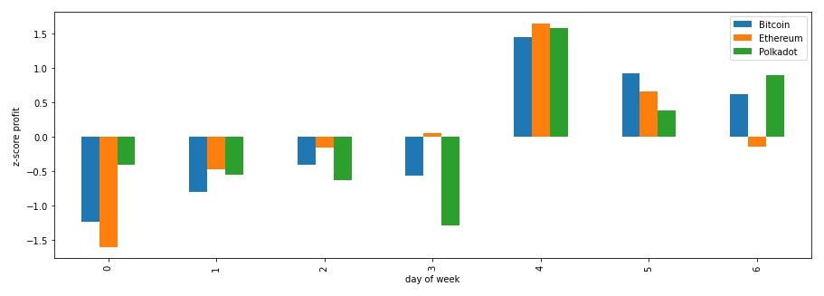
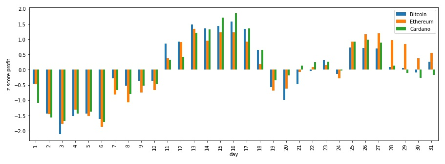

## Cryptocurrencies price analysis

This repository contains notebooks used to analyse prices flactuations for different cryptocurrencies over time.

The goal was to identify patterns and exploit them to plan an investment strategy accordingly.

**Dataset**

The dataset used for this analysis has been obtained from [Kaggle](https://www.kaggle.com/sudalairajkumar/cryptocurrencypricehistory) in July 2021 and can be found [here](./data).

**Assumptions**

The dataset provided the highest and lowest price for a coin on each day. We only considered the highest price in our analysis. In this way we assumed to operate in the worst case scenario where we buy for the highest price of that day.

### Analysis and results

We tried to answer questions such as:

**Question**

Which frequency has been the most profitable to implement, for a DCA (Dollar Cost Avaraging) investment strategy, for a specific coin?

**Answer**

The considered coins were: [BTC](https://bitcoin.org/da/) and [ETH](https://ethereum.org/en/). 

In both cases we observed that the monthly DCA has provided both the highest and lowest profits. Whereas the weekly frequency has provided the lowest standard deviation for profits over the different days of the week, but also a lower maximum profit.

We therefore concluded that the best approach for those aiming at maximising the profit is the monthly frequency, as long as the right day in the month is picked to invest, since the risk is to lower the profit if the wrong day is picked.
For a more stable profit, weekly seems to provide more constant profits, regardless of the days on which the investment is made.

For the complete analysis see [notebook](./notebooks/frequency_DCA.ipynb)

**Question**

In case of a weekly DCA, what was the day of the week that historically provided the highest profit?

**Answer**

It turned out that for a portfolio comprised of [BTC](https://bitcoin.org/da/), [ETH](https://ethereum.org/en/) and [DOT](https://polkadot.network/) the day providing the highest profit was <ins>Friday</ins>.

For the complete analysis see [notebook](./notebooks/weekly_DCA_most_profitable_day.ipynb)

**Question**

In case of a monthly DCA, what was the day of the month that historically provided the highest profit?

**Answer**

It turned out that for a portfolio with 50% [BTC](https://bitcoin.org/da/), 40% [ETH](https://ethereum.org/en/) and 10% [ADA](https://cardano.org/) the day of month providing the highest profit was the <ins>31st</ins>.

For the complete analysis see [notebook](./notebooks/monthly_DCA_most_profitable_day.ipynb)

**Question**

In case of a twice-a-month DCA, what was the combination of days of the month that historically provided the highest profit?

**Answer**

We analysed this usecase for [ADA](https://cardano.org/). Our results show that the top 10 best scoring combinations (with little delta profits among them) can be grouped into two categories: 

* Buying in the middle and at the end/beginning
* Buying both times in the middle

This suggests that half way through the month is a good spot to buy, even twice. Otherwise it is better to distantiate the purchases of two weeks, either starting at the beginning or the middle.

In our case the most profitable pair was the 1st day of the month and the 17th.

For the complete analysis see [notebook](./notebooks/twice_a_month_DCA_most_profitable_days.ipynb)
